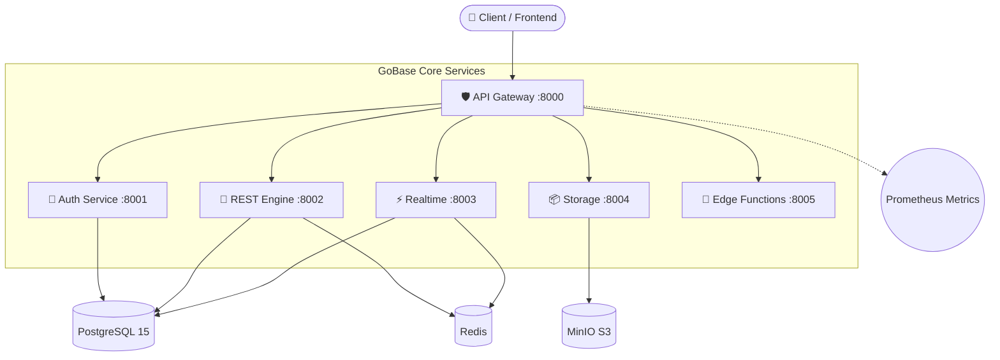

<div align="center">
  
  <p><strong>The open-source Backend-as-a-Service built for speed with Go and PostgreSQL.</strong></p>

  <!-- Badges -->
  <p>
    <a href="https://github.com/infocrud/gobase/stargazers"></a>
    <a href="https://github.com/infocrud/gobase/network/members"></a>
    <a href="https://github.com/infocrud/gobase/issues"></a>
    <a href="https://github.com/infocrud/gobase/blob/main/LICENSE"></a>
  </p>

  <p>
    <a href="#quick-start">Quick Start</a> •
    <a href="#architecture">Architecture</a> •
    <a href="#api-reference">API Reference</a> •
    <a href="DEPLOYMENT.md">Deployment Guide</a>
  </p>
</div>

---

**GoBase** is a lightning-fast, open-source alternative to Supabase and Firebase. It provides authentication, auto-generated REST APIs, realtime subscriptions, file storage, and edge functions — all from a single, low-memory footprint deployment powered by Go.

## ✨ Features

- 🔐 **Authentication**: JWT auth, OAuth2 (Google/GitHub), email verification, and password reset out of the box.
- 🚀 **Auto-generated REST**: Instant CRUD APIs with complete Row-Level Security (RLS) policies.
- ⚡ **Realtime**: WebSocket subscriptions that pipe database changes directly to your frontend clients.
- 📦 **Object Storage**: S3-compatible file storage powered by MinIO, featuring signed URLs.
- 🦕 **Edge Functions**: Deploy and execute custom logic using isolated Deno or Node.js runtimes.
- 🛡️ **Gateway**: Built-in API gateway with reverse proxying, Redis rate-limiting, and Prometheus metrics.

## 🥊 Why GoBase? (vs. Supabase/Firebase)

While Supabase is incredible, the Elixir + PostgreSQL stack can be heavy to self-host and complex to extend if you aren't familiar with Elixir. 
**GoBase** is built specifically for developers who prefer the **Go ecosystem**, require a **smaller memory footprint**, and want **PostgreSQL** without the heavy Elixir/Supabase stack. It runs blazingly fast on inexpensive VPS instances and compiles down to lightweight binaries.

## 🏗️ Architecture



## ⏱️ Quick Start (under 60 seconds)

### Prerequisites
- Go 1.22+
- Docker & Docker Compose
- *Optional: Deno or Node.js for edge functions*

### 1. Clone & Configure
```bash
git clone https://github.com/infocrud/gobase.git
cd gobase
cp .env.example .env
```

### 2. Start the Infrastructure
```bash
make docker-up   # Spins up PostgreSQL 15, Redis, and MinIO locally
```

### 3. Run Migrations
```bash
make migrate     # Initializes necessary system tables
```

### 4. Start Core Services
```bash
# Run services in the background (or use multiple terminals)
make run-auth &
make run-rest &
make run-realtime &
make run-storage &
make run-functions &

# Run the gateway in the foreground
make run-gateway
```

Check that everything is running smoothly:
```bash
curl http://localhost:8000/health/ready
# Expected: {"status":"ready","service":"gateway","checks":{"redis":"connected"}}
```

---

## 📚 API Reference Examples

### Authentication Examples
```bash
# Register a new user
curl -X POST http://localhost:8000/auth/signup \
  -H "Content-Type: application/json" \
  -d '{"email":"user@example.com","password":"StrongPassword1"}'

# Authenticate
curl -X POST http://localhost:8000/auth/login \
  -H "Content-Type: application/json" \
  -d '{"email":"user@example.com","password":"StrongPassword1"}'
```

### Database CRUD (REST) Examples
```bash
# Read rows (Requires JWT)
curl http://localhost:8000/rest/v1/products?limit=10 \
  -H "Authorization: Bearer <token>"

# Insert row
curl -X POST http://localhost:8000/rest/v1/products \
  -H "Authorization: Bearer <token>" \
  -H "Content-Type: application/json" \
  -d '{"name":"Go Plushie","price":19.99}'
```

### Storage Examples
```bash
# Upload an image to a bucket
curl -X POST http://localhost:8000/storage/v1/object/my-bucket/photo.jpg \
  -H "Authorization: Bearer <token>" \
  -F "file=@photo.jpg"
```

## 🛠️ Configuration
All configurations are managed via environment variables. See [`.env.example`](.env.example) for a complete list (over 40 variables supported).

## 🚀 Production Deployment
Refer to our comprehensive [DEPLOYMENT.md](DEPLOYMENT.md) for instructions on running GoBase via pre-compiled binaries, Docker (recommended), or Kubernetes.

## 🤝 Contributing
Contributions make the open-source community an amazing place to learn, inspire, and create. Any contributions you make are **greatly appreciated**. 

If you have a suggestion that would make this better, please fork the repo and create a pull request. You can also simply open an issue with the tag "enhancement". 
**Don't forget to give the project a star! Thanks again!**

## 📝 License
Distributed under the MIT License. See `LICENSE` for more information.
